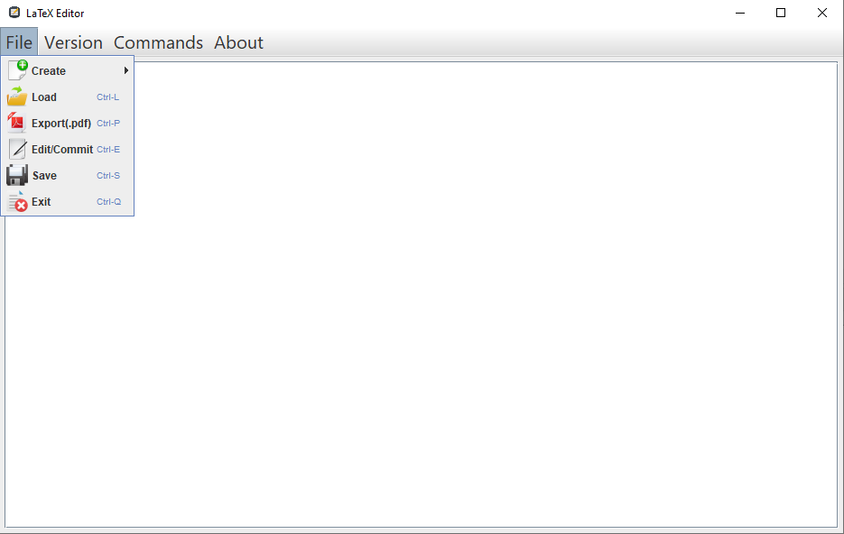

# LaTeX Editor

Latex is a well known high quality document preparation markup language. It provides a large
variety of styles and commands that enable advanced document formatting. Typically, a Latex document
is compiled with a tool like MikTex, Lyx, etc. to produce a respective formatted document in pdf, ps, etc.
Formatting documents with Latex is like a programming process as it involves the proper usage of Latex
commands which are embedded in the document contents. The objective of this project is to develop a
simple Latex editor for inexperienced Latex users. The goal of the editor is to facilitate the usage of Latex
commands for the preparation of Latex documents. One of the prominent features that distinguishes
the LatexEditor from other similar applications is its multi-strategy version tracking functionalities that
enable undo and redo actions.
 
<b>Project built with respect of design patterns</b>.

 

  

## Domain Properties

The LatexEditor enables the creation and management of subsequent versions of a Latex document. A
particular version of the Latex document is characterized by the following basic properties:
<li>The author.</li>
<li>The date that was last modified.</li>
<li>The copyright.</li>
<li>A version ID.</li>
<li>The contents of the document.</li>

Typically the contents of the Latex document contain Latex commands that specify the title (\title{...}) of
the document, the author (\author{...}), the (\date{}), and allow to structure the document properly
(e.g., \chapter{..}, \section{...}, \subsection{...}, etc.).

LatexEditor allows the users to create different types of Latex documents, starting from corresponding
<a href="https://github.com/gerasimosk/LaTeX-Editor/tree/master/Templates">templates</a> that are extended and customized by the users during the document editing process. Each
template specifies the basic document attributes and a skeleton document structure that serves as a
starting point for the document editing process. In particular, we consider the following templates.

## Functional Requirements / User Stories

- <b>User Story 1</b>: User want to create a new Latex document, based on a particular Latex document
template. If I don't specify a template, the application should create an empty Latex document.
- <b>User Story 2</b>: User want to edit the contents of the Latex document, via the application's user
interface.
- <b>User Story 3</b>: User want to add Latex commands in the Latex document automatically using the
application user interface. A minimal set of Latex commands that I want to use is given in Table 1.
Some of the commands are allowed only for specific types of Latex documents. The application
should notify me if I try to add Latex commands that are not allowed in the Latex document.
- <b>User Story 4</b>: User should be able to activate an automatic version tracking mechanism that keeps
track of the document evolution history, at any time. The history consists of a sequence of
subsequent versions of the Latex document. The mechanism should provide at least two alternative
storage strategies for the document evolution history:
<dl>
  <dd><b>Volatile (default strategy)</b>: for each document change the mechanism keeps the previous
version of the document in a main memory list of subsequent document versions.</dd>
  <dd><b>Stable</b>: for each document change the mechanism keeps the previous version of the
document on disk storage.</dd>
</dl>
- <b>User Story 5</b>: User should be able to change the storage strategy of the version tracking mechanism
at any time.
<dl>
  <dd>If I change from Volatile to Stable the application should store the document evolution
history on disk storage.</dd>
  <dd>If I change from Stable to Volatile the application should load the document evolution
history from disk storage to main memory.</dd>
</dl>
- <b>User Story 6</b>: User should be able to disable the version tracking mechanism at any time.
- <b>User Story 7</b>: User should be able to rollback to a previous version of the Latex document based on
the document evolution history. The application should notify me if I try to use the rollback action
and the version tracking mechanism has not been enabled before.
- <b>User Story 8</b>: User should be able to save the Latex document on disk storage.
- <b>User Story 9</b>: User should be able to load the Latex document from disk storage.

## Non Functional Requirements

<b>Extensibility</b>: In software engineering, extensibility is a design principle where the implementation
takes future growth into consideration. In the case of this project, extensibility concerns the supported
Latex templates, commands, version tracking strategies. Specifically, the application should be designed
such as the addition of new templates and strategies is as simple as possible and according to the well
known open-closed principle. To this end, several GoF design patterns can be considered <b>(Factory,
Command, Prototype, Strategy, etc.)</b>
<b>Usability<b>: In software engineering usability concerns the ease of use and learnability. In the context
of this project the application should enable the patterns specification via a simple and user-intuitive
interface. The application should also provide help, in the form of user guidelines, concerning its main
functionalities, and the contents of the different pattern templates.

## UML Diagrams

  

  

  

  

  

